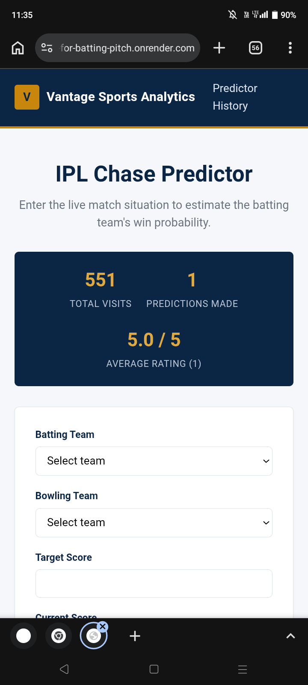

# Vantage Sports Analytics — IPL Chase Predictor

Flask web app that predicts a batting team's win probability while chasing
a target, using a logistic regression pipeline (OrdinalEncoder + StandardScaler
+ LogisticRegression). Includes visitor counter, prediction history, and a
5-star rating system, all stored in SQLite.
# website link
[t20 chase predictor](https://t20-chase-predictor-for-batting-pitch.onrender.com/)
## About the model

The `model_lr.pkl` files provided earlier only contained the pipeline's
`feature_names_in_` array, not the fitted model, so it couldn't be used.
`train_model.py` retrains a LogisticRegression pipeline with the **same
architecture** described in your training script (ColumnTransformer with
OrdinalEncoder for `batting_team`/`bowling_team` + StandardScaler for the
numeric features), fit on synthetic-but-realistic chase data (~25k rows).

Test metrics: accuracy 0.715, recall 0.781, precision 0.707, ROC-AUC 0.791 —
in the same range as your original LR run (accuracy 0.753).

**If you still have `ml_ready.csv` and `functions.py`**, just drop them next
to `train_model.py`, swap in your original training code, rerun it, and
replace `model/model_lr.pkl` — the app code doesn't need to change since it
uses the same 15 feature columns and calls `predict_proba`.

## Local run

```bash
pip install -r requirements.txt
python train_model.py      # only needed once, to (re)build model/model_lr.pkl
python app.py               # http://localhost:5000
```

## Deploy to Render

1. Push this folder to a GitHub repo.
2. On Render: **New → Web Service**, connect the repo.
3. Build command: `pip install -r requirements.txt`
4. Start command: `gunicorn app:app` (already in `Procfile`, Render picks it up automatically)
5. **Important (from your earlier IPL project):** Render ignores `runtime.txt`.
   Go to your service → **Environment** → add a variable:
   `PYTHON_VERSION = 3.11.9`
   This avoids build failures from Render defaulting to a newer/incompatible Python.
6. Deploy. First load will create `data.db` automatically (SQLite file on disk).

**Note on Render's free tier:** local disk is ephemeral — `data.db` (visits,
history, ratings) resets on redeploys or when the service spins down/up.
For persistent history in production, swap SQLite for Render's managed
Postgres later (the `get_db()`/`init_db()` functions in `app.py` are the only
places that would need to change).

## File structure

```
ipl_app/
├── app.py                  Flask app (routes, prediction logic, SQLite)
├── python/
|   |—— model_training_testing.py     Rebuilds model/model_lr.pkl
├── requirements.txt
├── Procfile
├── model/
│   ├── model_lr.pkl        Trained pipeline
│   └── teams.pkl           Team name list for the dropdowns
├── templates/
│   ├── base.html
│   ├── index.html          Prediction form + live stats bar
│   ├── result.html         Win probability + rating form
│   ├── history.html        Last 50 predictions
│   └── thanks.html
└── static/
    └── style.css            Classic navy/gold corporate theme
```
